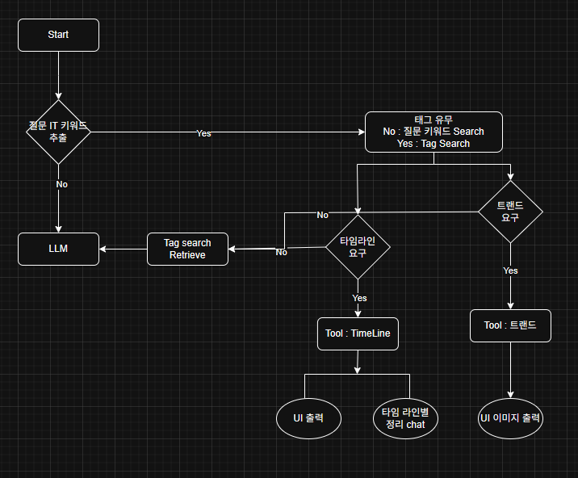
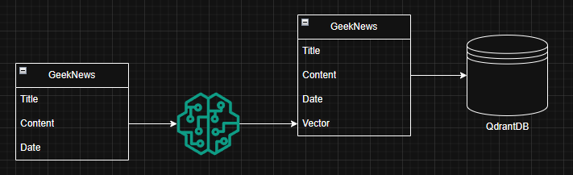

# GitNews 챗봇 생성 프로젝트

RAG & Langchain 기술을 사용하여 GitNews에서 사용하는 챗봇을 생성하는 프로젝트입니다. 
테그 기반 타임라인과 요약을 제공하고, 관련된 QA를 진행할 수 있습니다. 
일반적인 QA의 경우 키워드를 기반으로 대화 및 질의가 진행됩니다.

- **프로젝트 기한** : 2025.08.25 ~ 08.29
- **프로젝트 주제** : 테그 및 키워드 기반 QA, 타임라인 제공

 

## Team

|  |  |  |
| :--------------------------------------------------------------: | :--------------------------------------------------------------: | :--------------------------------------------------------------: |
|            [이승민](https://github.com/UpstageAILab)             |            [이재용](https://github.com/UpstageAILab)             |            [이승현](https://github.com/UpstageAILab)             |
|                            **팀장** VectorDB 및 Retreiver 구축 프로젝트 전반 관리                             |                            **팀원** streamlit UI 구축                             |                            **팀원** 프롬프트, 문서 작성                             |

 

## 문제 정의 및 기대 효과
- **문제 정의** : 기존 GitNews는 검색 기능이 없어, 사용자가 원하는 정보나 관련 문서를 빠르게 찾기 어렵습니다.  
- **해결 방안** : RAG 기반 검색 및 타임라인 기능을 제공하여, 입력된 키워드와 연관된 정보를 구조화된 형태로 탐색할 수 있도록 합니다.  
- **기대 효과** : 사용자는 필요한 정보를 빠르게 탐색하고, 관련 지식을 체계적으로 정리·파악할 수 있어 생산성과 효율성이 향상됩니다.  

 

## 개발 환경
- **주 언어** : python
- **DB 구축** : qdrant
- **컨테이너 및 실행 환경** : docker (docker compose 기반 환경 세팅)
- **UI** : streamlit

 

## 협업 툴
- **버전 관리** : GitHub
- **프로젝트 이슈 관리** : GitHub KanbanBoard
- **소통** : Slack

 

## UI

 

## 주요 Tasks
### 1. Tags 기반 Timeline & 요약 briefing
- _작품에 대한 주요 기능을 작성해주세요_
### 2. Tags 기반 QA
- _작품에 대한 주요 기능을 작성해주세요_
### 3. 키워드 기반 General QA
- _작품에 대한 주요 기능을 작성해주세요_

 

## System Architecture

## VerterDB Architecture

 

## 강사님 피드백 및 프로젝트 진행 과정
### 1차 피드백 (2025.08.25)
- Task를 더 구체화할 것 (현재 정의는 추상적임)
- **Baseline** 먼저 구축할 것
- 워크플로우(Workflow) 작성

### 2차 피드백 (2025.08.27)
- 태그 기반 작업을 위해 **VectorDB**에 키워드/태그 컬럼을 추가 임베딩하는 것 추천
- 프롬프트 엔지니어링이 중요한 요소일 듯함

 

## 참고자료
- [WikiDocs : 한 권으로 끝내는 랭체인 노트](https://wikidocs.net/251190)
